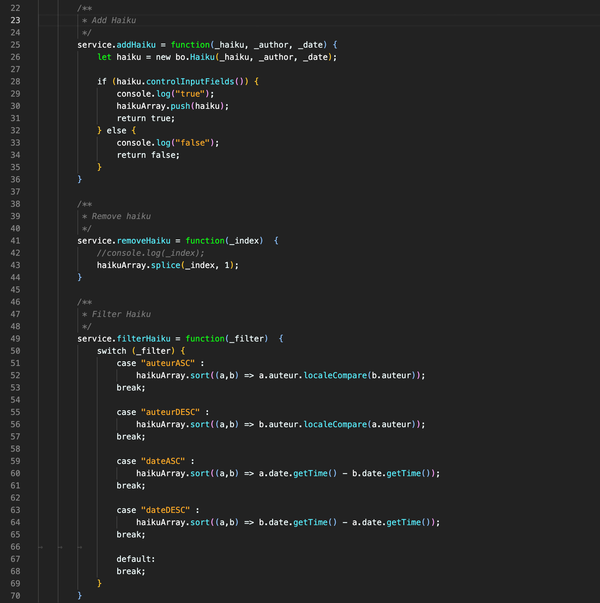

# Ange Theme for VS Code

## Description
Ange Theme is a dark theme for Visual Studio Code designed to edit HTML, CSS, PHP or Javascript code. With a limited palette of 5 colors, it allows you to differentiate the type of file you are editing and to work with a sober and functional environment.
Any suggestions are welcomed !

## Screenshots
CSS

JS

PHP

JAVA

HTML
# Ange-Theme
